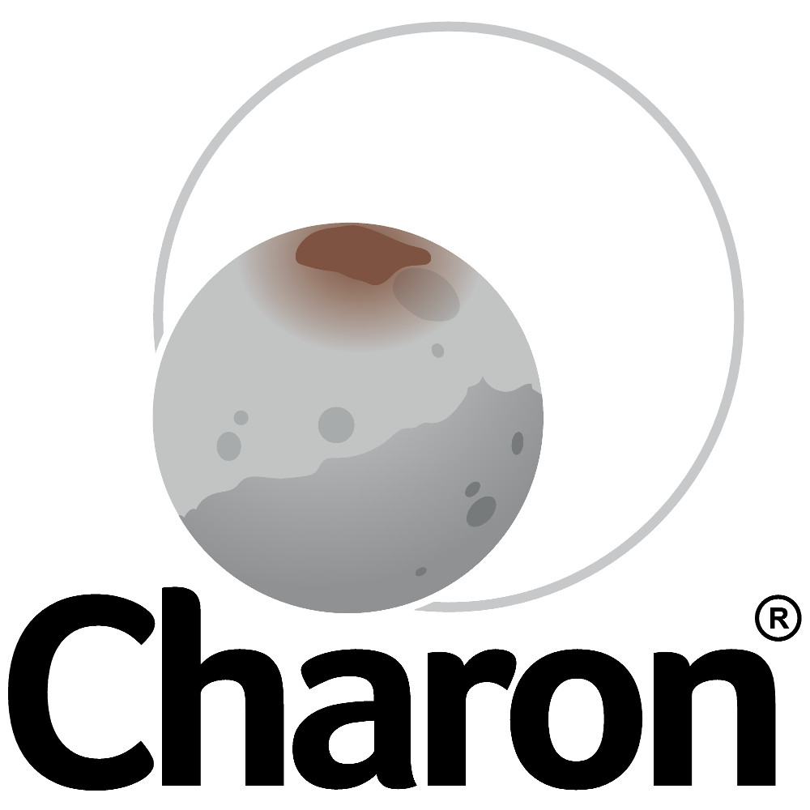

# CHARON PLATFORM

Charon is a industrial platform for web development (and others) of extremely fast and scalable web applications

http://charonplatform.org

debian

apt-get install libgl1-mesa-dev libglu1-mesa-dev
apt-get install libluajit-5.1-dev
apt-get install libcurl4-nss-dev
apt-get install libpq-dev
